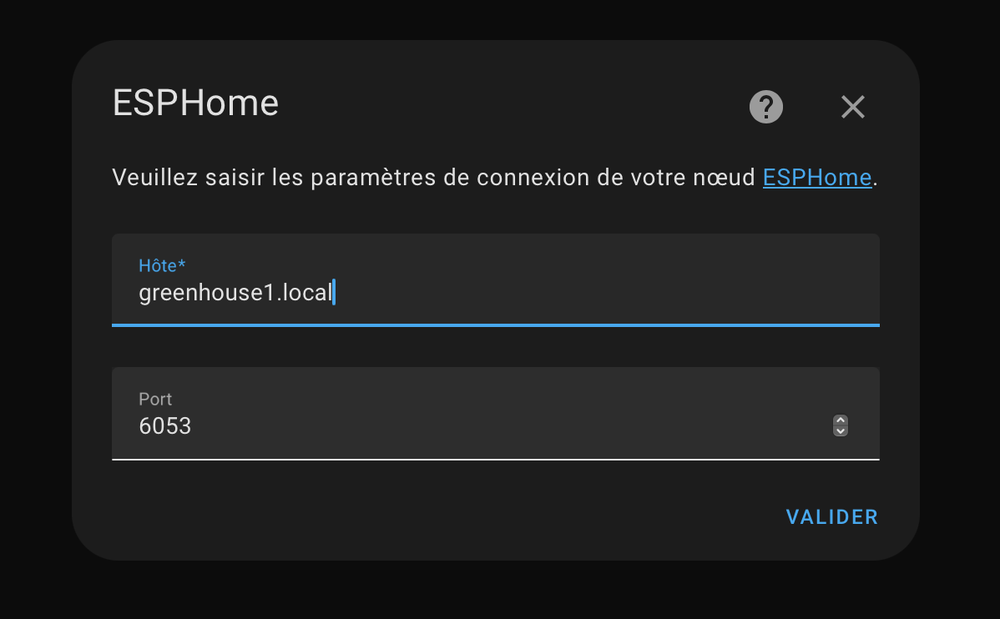
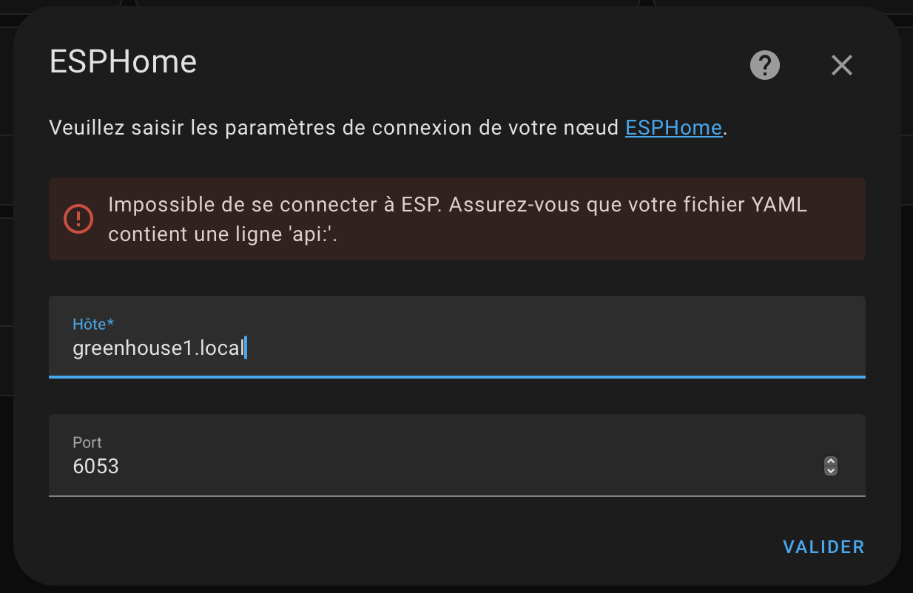

# ESPHome check 

Installation instructions:
https://esphome.io/guides/installing_esphome


## Mac

Python installation:

```
brew install python
python3 -m venv /Users/{user}/esp/esphome
source /Users/{user}/esp/esphome/bin/activate
```

Esphome installation:

```
pip3 install wheel
pip3 install esphome
```

Check installation:

```
esphome --version
```

Create a new project:

```
esphome wizard automated_greenhouse.yaml
```

Select board:
upesy_wroom - uPesy ESP32 Wroom DevKit [board](https://www.upesy.fr/products/upesy-esp32-wroom-devkit-board)

setup the DHT22 sensor:

```
esphome run automated_greenhouse.yaml
```




Check the dashboard:

```
pip install tornado esptool
mkdir config
esphome dashboard config
```

Open the dashboard: http://localhost:6052


FAQ with DHT22:

Problem:

```
[22:02:06][W][dht:175]: Requesting data from DHT failed!
[22:02:06][W][dht:060]: Invalid readings! Please check your wiring (pull-up resistor, pin number) and consider manually specifying the DHT model using the model option.
[22:02:06][D][sensor:094]: 'Greenhouse Temperature': Sending state nan °C with 1 decimals of accuracy
[22:02:06][D][sensor:094]: 'Greenhouse Humidity': Sending state nan % with 0 decimals of accuracy
[22:02:06][W][component:157]: Component dht.sensor set Warning flag: unspecified
```

Switch to 

model: **DHT22_TYPE2**

Problem: MDNS not working on Home Assistant 

Check to ping the device on my mac:

```ping greenhouse1.local
```

Check to ping the device on the docker host (ubuntu server):

````
ping: greenhouse1.local: Temporary failure in name resolution
````

Installation of avahi-daemon on the docker host:
```
apt-get update && apt-get install -y avahi-utils
```

now on the docker host:
```
avahi-browse -a | grep greenhouse1
```
return 
```
eno1 IPv4 greenhouse1                                   _esphomelib._tcp     local
```
and 
```
ping greenhouse1.local
```
works

But still not working on Home Assistant.



Check to ping the device inside the docker container: 

```
docker exec -it homeassistant ping greenhouse1.local
```
return 

```
ping: bad address 'greenhouse1.local'
```

Go inside the docker container:

```
docker exec -it homeassistant bash
```

I'm able to ping the device using the ip address:

```
ping 192.168.1.XXX
```
but not using the hostname.


New docker-compose.yml file: (neee to add /run/dbus & )

```yaml
services:
  homeassistant:
    container_name: homeassistant
    image: "ghcr.io/home-assistant/home-assistant:stable"
    volumes:
      - ./homeassistant-data:/config
      - /etc/localtime:/etc/localtime:ro
      - /run/dbus:/run/dbus:ro
    restart: unless-stopped
    privileged: true
    network_mode: host
    ports:
      - 8123:8123

```

The solution is to add /run/dbus to the docker-compose.yml file and change the network mode to host.

When I changed the network mode to host in HA, I had some issues with the Traefik configuration. 

**Bad Gateway**

I need to remove the traefik label config in the docker-compose.yml file and create a new ha-traefik.yaml file in the traefik/dynamic/ folder.


Sources:

https://medium.com/@andrejtaneski/using-mdns-from-a-docker-container-b516a408a66b
https://community.home-assistant.io/t/mdns-inside-ha-container/370146/2
https://www.home-assistant.io/installation/alternative