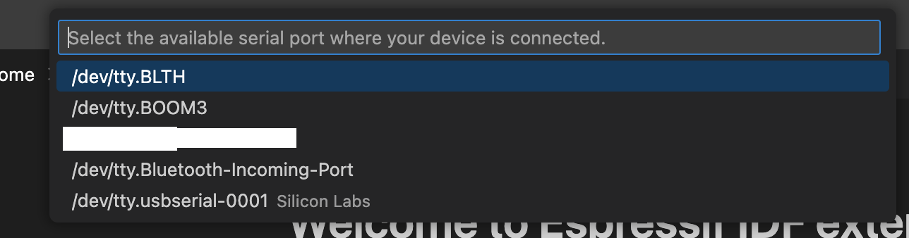
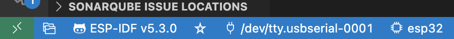

# How to use expressif examples

[Github-examples](https://github.com/espressif/esp-idf/tree/master/examples)

Go to your installation folder: 

for example for me (on macosx):
cd /Users/{user}/esp/esp-idf/examples

In this example I want to check ADC: 

```
cd /Users/{user}/esp/esp-idf/examples/peripherals/adc/oneshot_read
code .
```

Open a terminal: 

```
get_idf
```

You should obtain something like

```

Checking "python3" ...
Python 3.13.0
"python3" has been detected
Activating ESP-IDF 5.5
* Checking python version ... 3.13.0
* Checking python dependencies ... OK
* Deactivating the current ESP-IDF environment (if any) ... OK
* Establishing a new ESP-IDF environment ... OK
* Identifying shell ... zsh
* Detecting outdated tools in system ... Found tools that are not used by active ESP-IDF version.

[.......]

Done! You can now compile ESP-IDF projects.
Go to the project directory and run:

  idf.py build

```

Select the port: 





Next:

    idf.py clean
    idf.py menuconfig
    idf.py build flash monitor


